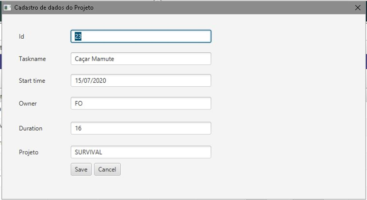
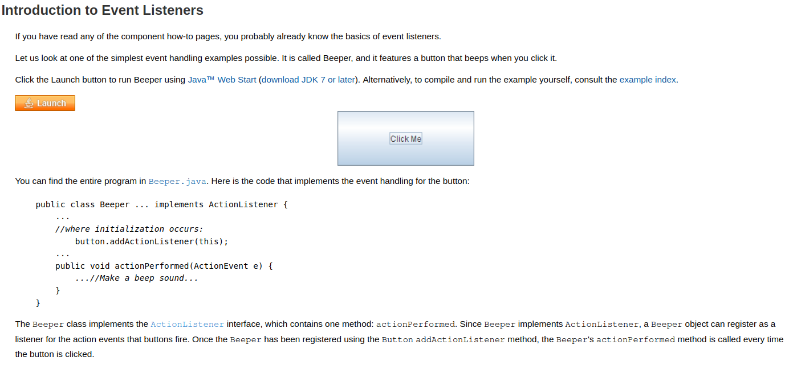

# PORTFOLIO - LIST OF ACADEMIC PROJECTS:

[PROJECT-SEMESTRE-01-2019.2 - *Python WebBot - Scrapping - Public Safety Monitor*](https://github.com/ODAGAMMXIX/PFOLIO1_DANZO) 

### [PROJECT-SEMESTRE-02-2020.1 - *Java Stand Alone GANTT Chart tool*](https://github.com/ODAGAMMXIX/PFOLIO2_GANTT)

[PROJECT-SEMESTRE-03-2020.2 - *Java Web App - Benefits According Credit Score*](https://github.com/ODAGAMMXIX/PFOLIO3_VALCODE) 
#
## ***SECOND PROJECT, SEMESTRE-02-2020.1 - Java Stand Alone GANTT Chart tool***
#

###**I - RESUMO DO PROJETO.**

Empresa parceira "NECTO" figurou como cliente.

Desafio: desenvolver uma aplicação visual emulando um Gráfico de GANTT para gerenciar o tempo de seus recursos humanos em projetos de desenvolvimento de softwares.

Programa simples e funcional, de baixa manutenção para:

* **Gerenciar carga horária** por tarefa, por colaborador;
* **Distribuir uniformemente** as tarefas;
* Equilibrar a **relação custo x receita** dos projetos;
* Obter **previsibilidade de faturamento** e de ações comerciais;
* Gerenciar **tarefas e projetos possíveis**  por equipe;
* Permitir **um dia = unidade mínima de tempo**;

**ARQUITETURA**

**1- Camadas:**
 
 
 
 
 
 **1.1- Diagrama de Casos de Uso.**

.png)

**2- Modelagem Conceitual - Banco de Dados MYSQL.**

**3- Diagrama Lógico - MYSQL**

**4- Tela de Login.**

**5- Tela de Cadastro do Projeto com CRUD**.

**6- Tela de Cadastro do colaborador com CRUD.**

**7- Tela de Cadastro da Tarefa com CRUD**.

 

**8- Gráfico de Gantt interativo** com seleção de projeto, cada tarefa com a data inicial e final e suas dependências (**clica-arrasta-redimensiona**).

### II - TECNOLOGIAS ADOTADAS NA SOLUÇÃO 

- linguagem: ***Java*** (métodos *getters, setters* e o *serializable* - processo no qual a instância de um objeto é transformada em uma sequência de bytes, útil para enviar objetos pela rede, salvar em disco ou pra comunicação entre JVMs)

    Classes, Objetos. Atributos e Métodos de Acesso;​

    Construtores, Getters and Setters;​

    Arrays, ArrayLists;​

    Polimorfismo;​

    C.R.U.D.;​

    Java Database Conectivity (JDBC);​

    Data Access Object (DAO);​

    Tratamento de Erros (Try & Catch & Finally);​

#
- Bibliotecas: 
#
--***Util***: [*"Contains the collections framework, legacy collection classes, event model, date and time facilities, internationalization, and miscellaneous utility classes (a string tokenizer, a random-number generator, and a bit array)"*](https://docs.oracle.com/javase/8/docs/api/java/util/package-summary.html).

--***Calendar***: produz valores típicos de calendário, com formatação de data e hora e dependência no gráfico de Gantt.

#

-- ***Nebula***: gera o gráfico de GANTT personalizável, permite a interação do usuário (clica-arrasta-redimensiona) e interação de dependência.

-- ***JavaFx***: para aplicações desktop (front-end), com telas para exibição CRUD para classes Tarefa, Projeto e Funcionário.

.png)

- Camada ***Controller***: classes Projeto, Tarefa e Cadastros, com 2 classes *Controller* para cada entidade (.java e .fxml de conexão com o javaFx ao front-end). 

.png)

- Camada ***Service***: classes Tarefa Service e Cadastro Service com métodos na interface DAO.

 - Camada ***Service implements***: classes Tarefa e Cadastro, com métodos definidos no Service com interface DAO usando o JDBC.

- ***Java Database Connectivity (JDBC)*** conector com instruções SQL par bancos de dados relacionais; 

- Classes ***DAO***: para conexão e CRUD com o Banco de Dados.

- IDE Eclipse.

- SGBD: MySQL.

-  metodologia: Scrum.

- ci: Docker / DockerCompose.

Foram testadas e abandonadas:
- SGBD: PostgreSQL.
- Biblioteca Gantt / JFreeCharts.

.png)

### III - CONTRIBUIÇÕES INDIVIDUAS/PESSOAIS 

- Atuei como **agente de pesquisa e desenvolvimento** (*R&D*) e segundo Scrum Master e segundo Product Owner.

- **Descobri a biblioteca ***Nebula*** **e ensinei os colegas a integrá-la ao código (**possibilitou a entrega de gráfico INTERATIVO**).

- **Fui um dos DBA do projeto**, administrando o banco de dados com as seguintes tabelas:

TABELA TAREFA

.png)

TABELA PROJETO

.png)

TABELA USUÁRIO

.png)

- Realizei as **Apresentações Comerciais** e editei o README.MD em todas as SPRINTS e vídeos;

### IIII - APRENDIZADOS EFETIVOS

-  Tratamento de EVENTOS: 

- Aplicação desktop;
- administração e desenvolvimento de banco de dados (comandos básicos INSERT, UPDATE, DELETE, SELECT, ALTER TABLE etc.)

- GitHub;

- ênfase em ***soft skills*** com o início da Pandemia do COVID-19 com imersão técnica durante o isolamento social.
