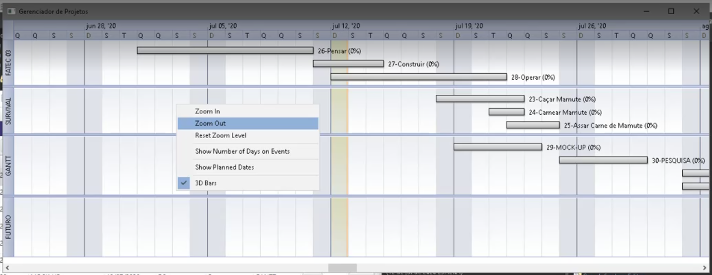

## PORTFOLIO ACADÊMICO - PROJETOS INTEGRADORES:

[SEMESTRE-01-2019.2 - *Python-Sqlite3 Web Scrapper - Monitor de Segurança Pública*](https://github.com/ODAGAMMXIX/PFOLIO1_DANZO) 

## [SEMESTRE-02-2020.1 - *Java-MySQL Stand Alone App - Gráfico de GANTT para Gestores*](https://github.com/ODAGAMMXIX/PFOLIO2_GANTT)

[SEMESTRE-03-2020.2 - *Java-Oracle - Gamificação, Monetização, Fidelização e Educação Financeira*](https://github.com/ODAGAMMXIX/PFOLIO3_VALCODE)

[SEMESTRE-04-2021.1 - *Java-Oracle API - Recrutamento por Geolocalização et al*](https://github.com/ODAGAMMXIX/PFOLIO4_JOBNATION)

[SEMESTRE-05-2021.2 - *Java-Pentaho-My(SQL)Server-MongoDB-Engajamento Estudantil*](https://github.com/ODAGAMMXIX/PFOLIO5_EDUCALYTICS)

[SEMESTRE-06-2022.1 - *Python-MongoDB-LGPD Opt-in, Opt-out*](https://github.com/ODAGAMMXIX/PFOLIO6_OPTIN_OUT)

***

<h1 align="center">[Java-MySQL Stand Alone App - Gráfico de GANTT para Gestores]</h1>

<h5 align="center">(vídeo)</h5>

# **I - RESUMO DO PROJETO.**

Desafio: desenvolver uma aplicação visual emulando um Gráfico de GANTT para gerenciar o tempo de seus recursos humanos em projetos de desenvolvimento de softwares.

*Requisitos Funcionais* de um programa simples e funcional, de baixa manutenção para:

:arrow_right: **Gerenciar carga horária** por tarefa, por colaborador;

:arrow_right: **Distribuir uniformemente** as tarefas;

:arrow_right: Equilibrar a **relação custo x receita** dos projetos;

:arrow_right: Obter **previsibilidade de faturamento** e de ações comerciais;

:arrow_right: Gerenciar **tarefas e projetos possíveis**  por equipe;

:arrow_right: Permitir **um dia = unidade mínima de tempo**;

Escolhemos o  para praticar a linguagem ensinada no semestre.

 1) Arquitetura.

 
 

 
  

 

 1.1) Diagrama de Casos de Uso.

 

 

2) Modelagem Conceitual - Banco de Dados. .

 

 Modelo.

 

 

3) Diagrama Lógico - ![MySQL].(https://img.shields.io/badge/mysql-%2300f.svg?style=for-the-badge&logo=mysql&logoColor=white)

 Diagrama.

 

 
 

 

 4) Tela de Login.

 

 
 

 5) Tela de Cadastro do Projeto com CRUD.

 

 
 

 6) Tela de Cadastro do colaborador com CRUD.

 

 
 

 7) Tela de Cadastro da Tarefa com CRUD.

 
 

 
 

 8) Gráfico de Gantt interativo** com seleção de projeto, cada tarefa com a data inicial e final e suas dependências 

 <h3 align="center">(clica-arrasta-redimensiona by Nebula).</h3>

 
 

 
 

# II - TECNOLOGIAS ADOTADAS NA SOLUÇÃO 

:wrench: Linguagem : métodos *getters, setters* e o *serializable* - processo no qual a instância de um objeto é transformada em uma sequência de bytes, útil para enviar objetos pela rede, salvar em disco ou pra comunicação entre JVMs, com destaque para:

:orange_circle:  Classes, Objetos. Atributos e Métodos de Acesso;​

:orange_circle: Construtores, Getters and Setters;​

:orange_circle: Arrays, ArrayLists;​

:orange_circle: Polimorfismo;​

:orange_circle: C.R.U.D.;​

:orange_circle:  Java Database Conectivity (JDBC);​

:orange_circle: Data Access Object (DAO);​

:orange_circle: Tratamento de Erros (Try & Catch & Finally);​

#
## Bibliotecas  e Classes, por camada: 
#

<h3 align="center">VIEW</h3>

:orange_circle: ***Util***: [*"Contains the collections framework, legacy collection classes, event model, date and time facilities, internationalization, and miscellaneous utility classes (a string tokenizer, a random-number generator, and a bit array)"*](https://docs.oracle.com/javase/8/docs/api/java/util/package-summary.html).

:orange_circle: ***Calendar***: produz valores típicos de calendário, com formatação de data e hora e dependência no gráfico de Gantt.

(Clique aqui)

 
 

 
 

:orange_circle:  ***Nebula***: gera o gráfico de GANTT personalizável, permite a interação do usuário (clica-arrasta-redimensiona) e interação de dependência.

(Clique aqui)

:orange_circle:  ***JavaFx***: para aplicações desktop (front-end), com telas para exibição CRUD para classes Tarefa, Projeto e Funcionário.

(Clique aqui)

<h3 align="center">CONTROLLER</h3>

:orange_circle: ***Classes*** Projeto, Tarefa e Cadastros, com 2 classes *Controller* para cada entidade (.java e .fxml de conexão com o javaFx ao front-end). 

(Clique aqui)

<h3 align="center">SERVICE</h3>

:orange_circle: ***Classes*** TarefaService e CadastroService com métodos na interface DAO.

(Clique aqui)

<h3 align="center">SERVICE IMPLEMENTS</h3>

:orange_circle: ***Classes*** Tarefa e Cadastro, com métodos definidos no Service com interface ***DAO*** usando o ***JDBC***.

<h3 align="center">JAVA DATABASE CONECTIVITY (JDBC)</h3>

:orange_circle:  ***Conector*** com instruções SQL para bancos de dados relacionais, definido pela IBM como [*Java™ database connectivity (JDBC) is the JavaSoft specification of a standard application programming interface (API) that allows Java programs to access database management systems. The JDBC API consists of a set of interfaces and classes written in the Java programming language.*](https://www.ibm.com/docs/en/informix-servers/12.10?topic=started-what-is-jdbc)

(Clique aqui)

<h3 align="center"> Data Access Object (DAO) </h3>

:orange_circle:  Desin Pattern adaptável, utilizado para conexão com, e CRUD no, Banco de Dados, assim definido pela Oracle: [*The DAO pattern allows data access mechanisms to change independently of the code that uses the data.*](https://www.oracle.com/java/technologies/data-access-object.html)

(Clique aqui)

:wrench: SGBD: .
 

(Clique aqui)

:wrench: IDE .

:wrench: IDE .

:wrench:  metodologia: Scrum.

Foram testadas e abandonadas:

:wrench: SGBD: .

:wrench: Biblioteca Gantt / JFreeCharts (Estudada e Abandonada).

(Clique aqui)

 
 
# III - CONTRIBUIÇÕES INDIVIDUAS/PESSOAIS 

<h3 align="center">PESQUISA E DESENVOLVIMENTO</h3>

:axe: Atuei como **agente de pesquisa e desenvolvimento** (*R&D*) e segundo *Scrum Master* e segundo *Product Owner*.

:axe::axe: **Descobri a biblioteca** ***Nebula*** e ensinei os colegas a integrá-la ao código (**possibilitou a entrega de gráfico INTERATIVO**).

(Clique aqui)

 

<h3 align="center">ADMINISTRADOR DE BANCO DE DADOS</h3>

:axe::axe::axe: **Fui um dos DBA do projeto**, administrando o banco de dados com as seguintes tabelas:

<h4 align="center">TABELA "TAREFA"</h4> 

(Clique aqui)

<h4 align="center">TABELA "PROJETO"</h4> 

(Clique aqui)

<h4 align="center">TABELA "USUÁRIO"</h4> 

(Clique aqui)

:axe::axe::axe::axe: Realizei as **Apresentações Comerciais** e editei o README.MD em todas as SPRINTS e editei os vídeos;

# IIII - APRENDIZADOS EFETIVOS

Neste projeto, atuei como agente de pesquisa e desenvolvimento (*R&D*), administrador de banco de dados, *Product Owner* e *Scrum Master*. Logo, houve aprendizados em múltiplas áreas. vejamos.

:heavy_check_mark:  [Engenharia de Software] Tratamento de EVENTOS [(***Event Listeners***)](https://docs.oracle.com/javase/tutorial/uiswing/events/intro.html), melhor definidos como ["*An event can be defined as changing the state of an object or behavior by performing actions. Actions can be a button click, cursor movement, keypress through keyboard or page scrolling, etc.*"](https://www.geeksforgeeks.org/event-handling-in-java/)

Eventos.
 

 

 

:heavy_check_mark: Desafios de uma aplicação Desktop, direcionados pelas limitações da biblioteca *Nebula*, a mais versátil e apropriada para os requisitos funcionais do projeto [U.X.]; porém, incompatível com o padrão web.

    
:heavy_check_mark: Administração e desenvolvimento de banco de dados (comandos básicos INSERT, UPDATE, DELETE, SELECT, ALTER TABLE etc.), em auto-aprendizado, por meio da documentação do .

 

Banco de dados.

 

 

 
:heavy_check_mark: Introdução ao estudo autônomo do , necessário para garantir o trabalho contínuo da equipe em isolamento social;

:heavy_check_mark: ***Soft skills:*** Pesquisa em sites estrangeiros, comunicação com "Gen Z", trabalho comercial e de relacionamento com stakeholders. Com o início da Pandemia do COVID-19 e a saída de 2 *Scrum Team Members*, foi necessária muita negociação individual com os colegas e professores para consolidar o projeto, exigida imersão técnica durante o isolamento social.

The End.
:arrow_up: 
[`Go Back Up`](#java-mysql-stand-alone-app---gr%C3%A1fico-de-gantt-para-gestores).
